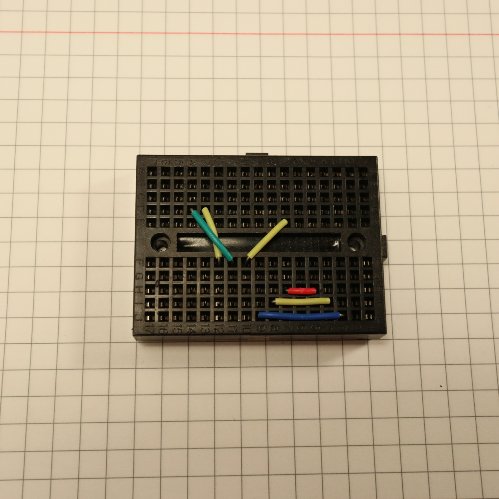
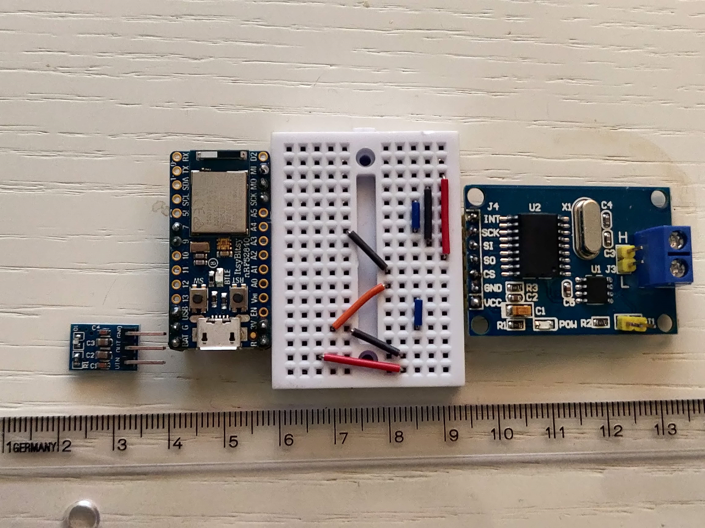
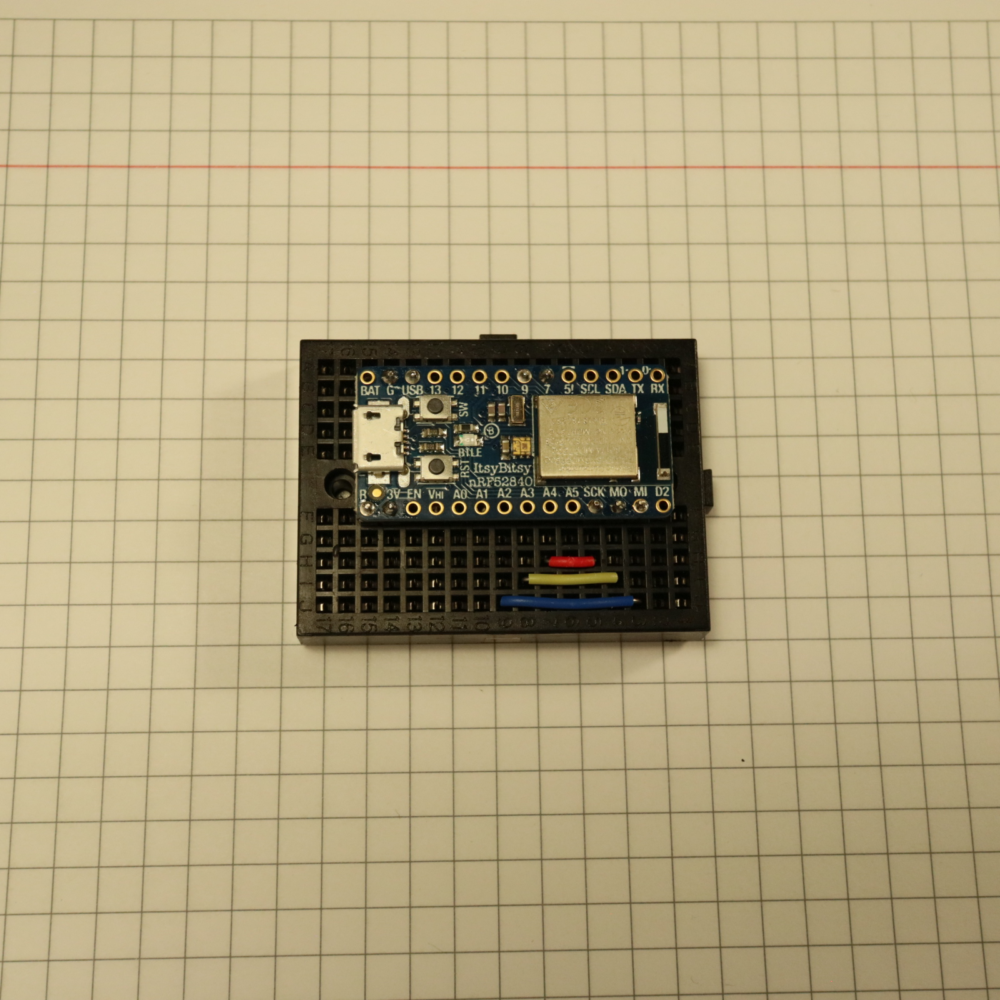
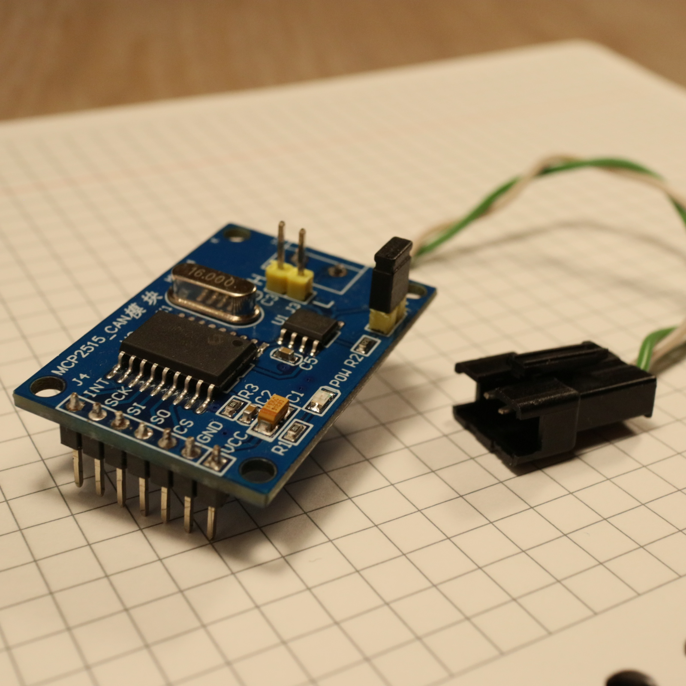
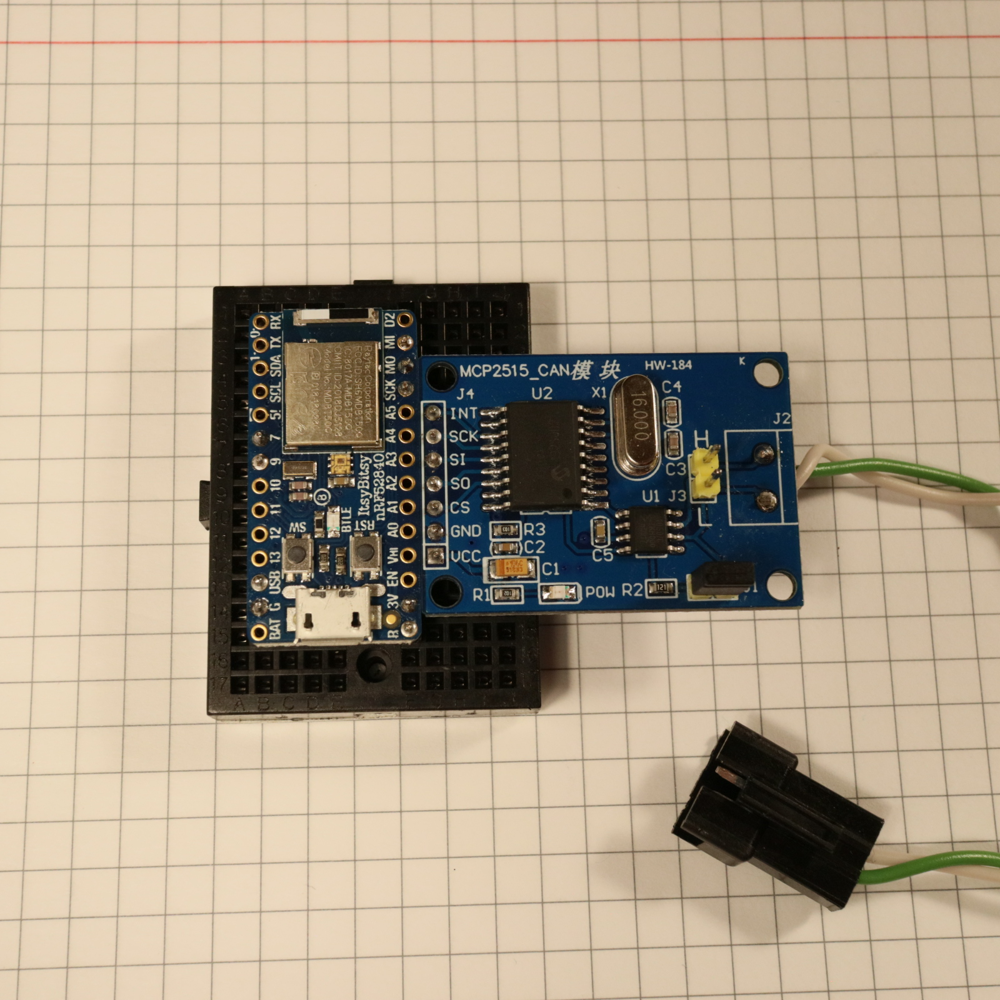
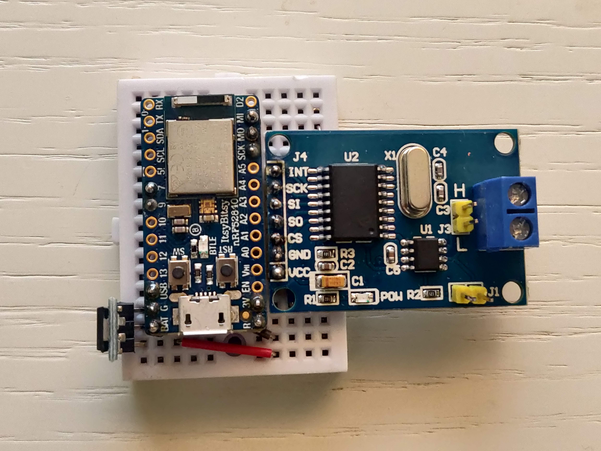
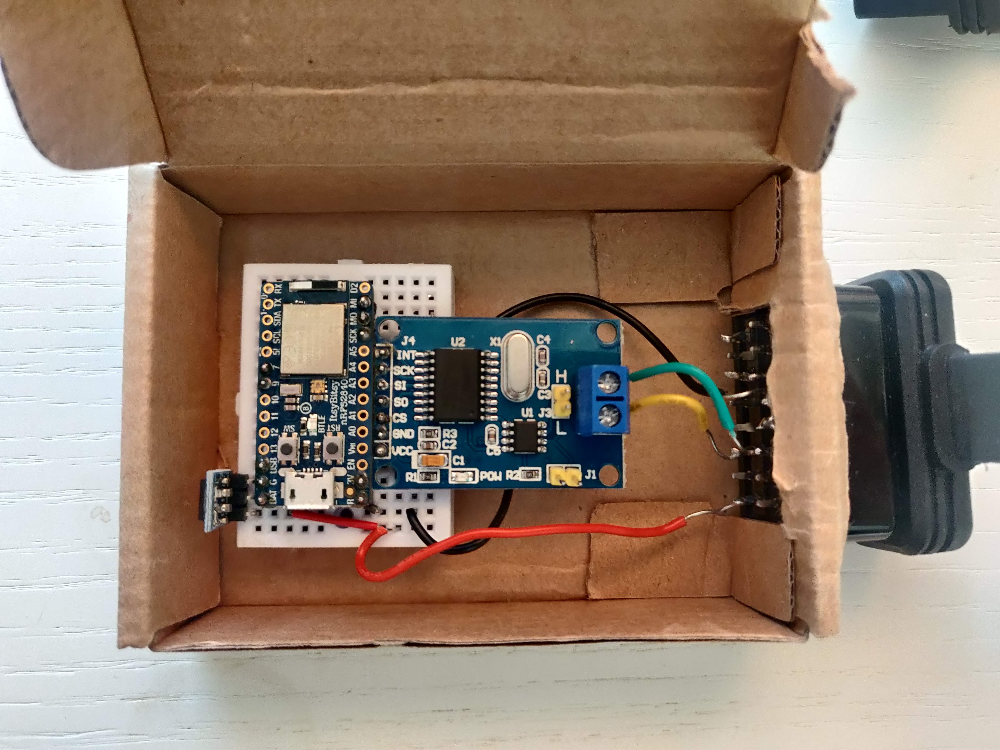

# RaceChronoDiyBleDevice
DIY BLE device for RaceChrono, currently supports reading data from the CAN bus.

This fork from timurrrr work is implementing CAN IDs specific to the MX-5 3rd generation (NC, NCFL, NCFLFL).
IDs 085 and 081 are specific to cars with DSC, but it should be straightforward to
tweak the code for other cars.

## Safety disclaimer

CAN bus is like a "nervous system" in a car. It is a network that connects
various ECUs, sensors, etc. Connecting a new device to this network poses risks
such as data corruption, packet losses, etc., that can negatively affect the
performance of some or all components of a car. Same applies to incorrect
connections and alternations of the CAN bus wiring. This can cause various
undesirable effects, such as "Check engine" lights, electrical and mechanical
damage, loss of control, injuries and even death.

By using any information or code in this project you assume any and all risk,
and release any liability from the author(s) and contributors to this project.

## Supported Hardware

* Adafruit ItsyBitsy nRF52840 Express
* Adafruit Feather nRF52832
* 16 MHz MCP2515 breakout boards (probably MCP25625 as well)

## Prerequisites

You will need to install two libraries for Arduino:
```sh
cd ~/Documents/Arduino/libraries/  # ~/Arduino/libraries on Mac OS
git clone https://github.com/timurrrr/arduino-CAN CAN
git clone https://github.com/timurrrr/arduino-RaceChrono arduino-RaceChrono
```

It's important that you don't use the arduino-CAN library available in the
Arduino IDE built-in library manager, as it has multiple bugs, and many
operations are implemented in an ineffective way. My pull requests to address
those have not been reviewed at the time of writing.

## Assembling

Recommended parts list:

* [Adafruit ItsyBitsy nRF52840 Express](https://www.adafruit.com/product/4481)
* [MCP2515 boards](https://www.amazon.com/gp/product/B07J9KZ4L4/) (2+ pcs recommended so you can test without a car). [Link alternativo ad AMAZON ITALIA](https://amzn.to/3ejeWqR).
* [16 MHz quarz oscillators](https://www.amazon.com/gp/product/B00NQ82OM0/) (in case your MCPs have 8 MHz quartzes). [Link alternativo ad AMAZON ITALIA](https://amzn.to/3eh4CzE).
* [Jumper](https://www.sparkfun.com/products/9044) (in case your MCP comes without it, like mine).. [Link alternativo ad AMAZON ITALIA, include anche pin header](https://amzn.to/3eq9LW2)
* [Mini Breadboard](https://www.sparkfun.com/products/12047). [Link alternativo ad AMAZON ITALIA](https://amzn.to/3bw2Wk6).
* [Jumper wires](https://www.sparkfun.com/products/124). [Link alternativo ad AMAZON ITALIA](https://amzn.to/3t1Jql9)
* [~22 AWG wires ](https://amzn.to/38nxNwW)
* [JST SM connectors](https://www.amazon.com/gp/product/B07QG2TN1X/) **NOT NEEDED IF YOU DO THE OBD CONNECTOR ALTERNATIVE**
* Crimping tool for JST connectors **NOT NEEDED IF YOU DO THE OBD CONNECTOR ALTERNATIVE**

**ALTERNATIVE:**
* [OBD male connector](https://amzn.to/3l5thsf)
* [12V to 5V stepdown DC DC converter to draw power from OBD pin 16](https://amzn.to/3qvYfuy)

First, solder the male headers to your microcontroller board.
You'll need G, 3V, SCK, MO, MI and 7.
**ALTERNATIVE:** I've soldered also a pin for "BAT" to send the power from 12V - 5V stepdown
It's also recommended to solder 9, R and USB for future improvements and
mechanical stability on the breadboard.
Soldering male headers is a lot easier if you first insert them into a
breadboard.

Put the jumpers on the breadboard this way to allow for neat hidden
connections:



**ALTERNATIVE:** here with the 12V-5V stepdown to get power from OBD port



Then, put the microcontroller board on the breadboard:



Un-solder the header from the MCP board and solder a new header on the other
side of the board to make it more breadboard-friendly.
This step is copletely optional and only needed to improve the compactness of the assembly

Replace the 8 MHz quartzes on your MCPs with 16 MHz quartzes, if needed.
Install the jumper that connects the 120 Ohm terminal resistor.
Optionally, un-solder the screw terminal and solder a twisted pair of wires to
the board, and finish with a nice JST SM connector:



Finally, put the MCP on the breadboard.



**ALTERNATIVE**: Here with 12V to 5V converter for getting power from car


Check connections:

MCP pin | Microcontroller pin
------- | ------------------
VCC | 3V
GND | G
CS | 7
SO | MI
SI | MO
SCK | SCK
INT | Currently unused, may use 9 in the future

Connections with 12V to 5V stepdown
Stepdown pin | Microcontroller pin | OBD pin
------- | ------------------ | --------
VIN | - | 16
VOUT | BAT | -
GND | G | 4 and 5 

For OBD pin refer to this pinout diagram


this showed here is the front view of the female connector, that is a perfect
match for the back of a male connector.
* Pin 4 and 5 (grey) are chassis ground and signal ground, black cable in picture below
* Pin 6 (green, top) is CAN High, green cable in picture below
* Pin 14 (green, bottom) is CAN Low, yellow cable in picture below
* Pin 16 (red) is 12V power from battery, red cable in picture below



Just remember that there is always power at pin 16 on OBD, even if the
car is shut down with no key.

Optionally, put everything into a nice enclosure, possibly not cardboard :D


## Tweaking to work with your car

This particular example is optimized to work with Mazda MX5 2010 third generation
with DSC
You can search for "MX5" in the source code to see where
the customizations were made, and tweak to work better with your car.

## Testing

You don't need to always be in the car to test changes.
Instead, you can build another device (possibly using a cheaper board, such as
Arduino Uno), and edit the
[FakeSubaruBRZ example](https://github.com/timurrrr/arduino-CAN/tree/master/examples/FakeSubaruBRZ)
from timurrrr fork of the `arduino-CAN` library, and connect the two boards into a
small CAN network. Note that you don't need to use a jumper to connect the
120 Ohm resistor on the second board in a CAN network (right?).

## Contributions

I'd be happy to add more info on the CAN protocol for other popular sport cars.
Feel free to send pull requests!

## Support the project

Support timurrrr https://github.com/timurrrr/

I hope you found this project useful, entertaining, educating, etc.
Personally, I was amazed that for just ~$50 it's possible to get a data logging
system comparable to the "go to" devices that HPDE enthusasts use that cost 10x+
more. And since the "brain" of such a data acquisition system is RaceChrono, you
don't need to fiddle with cables, laptops, etc. to review your data when you
come back to the pits between sessions.

Having said that, I've spent a few too many evenings on this project, and this
is not my paid job. I have some more exciting ideas on how to further improve
this project, make it more accessible, support more car models... but can't
justify spending too much more time on it. If you want to thank me for what I've
already shared, or support my future ideas, I will appreciate it if you send me
some "boba tea money".

Here's a PayPal shortcut for your convenience:

[](https://www.paypal.com/donate?business=ZKULAWZFJKCES&item_name=Donation+to+support+the+RaceChronoDiyBleDevice+project&currency_code=USD)
