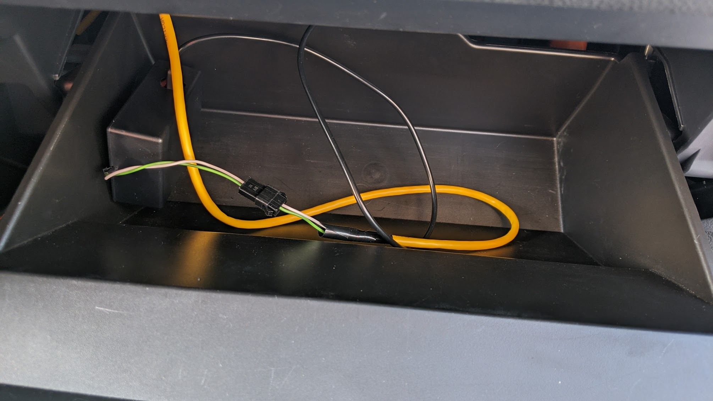

# RaceChronoDiyBleDevice
DIY BLE device for RaceChrono, currently supports reading data from the CAN bus.

There are some optimizations in the code that are specific to the FT86 platform
cars (Subaru BRZ, Toyota 86, Scion FR-S), but it should be straightforward to
tweak the code for other cars.

## Demo

Here is a video demonstrating data acquired using this device:
[](https://www.youtube.com/watch?v=j01LALSN7dQ)

[Here](https://www.ft86club.com/forums/showthread.php?p=3347436#post3347436)
is a post with more info on how I got RaceChrono displayed on my headunit via
Android Auto.

## Safety disclaimer

CAN bus is like a "nervous system" in a car. It is a network that connects
various ECUs, sensors, etc. Connecting a new device to this network poses risks
such as data corruption, packet losses, etc., that can negatively affect the
performance of some or all components of a car. Same applies to incorrect
connections and alternations of the CAN bus wiring. This can cause various
undesirable effects, such as "Check engine" lights, electrical and mechanical
damage, loss of control, injuries and even death.

By using any information or code in this project you assume any and all risk,
and release any liability from the author(s) and contributors to this project.

## Assembling the hardware

This section describes how to build the hardware for the CAN bus reader with a
JST SM connector. The connector can then be used to connect to a car-specific
harness for the CAN bus.

Recommended parts list:

* [Adafruit ItsyBitsy nRF52840 Express](https://www.adafruit.com/product/4481)
* [MCP2515 boards](https://www.amazon.com/gp/product/B07J9KZ4L4/) (2+ pcs recommended so you can test without a car)
* [16 MHz quarz oscillators](https://www.amazon.com/gp/product/B00NQ82OM0/) (in case your MCPs have 8 MHz quartzes)
* [Jumper](https://www.sparkfun.com/products/9044) (in case your MCP comes without it, like mine)
* [Mini Breadboard](https://www.sparkfun.com/products/12047)
* [Jumper wires](https://www.sparkfun.com/products/124)
* [JST SM connectors](https://www.amazon.com/gp/product/B07QG2TN1X/)
* Crimping tool for JST connectors
* ~22 AWG wires

First, solder the male headers to your microcontroller board.
You'll need G, 3V, SCK, MO, MI and 7.
It's also recommended to solder 9, R and USB for future improvements and
mechanical stability on the breadboard.
Soldering male headers is a lot easier if you first insert them into a
breadboard.

Put the jumpers on the breadboard this way to allow for neat hidden
connections:


Then, put the microcontroller board on the breadboard:


Un-solder the header from the MCP board and solder a new header on the other
side of the board to make it more breadboard-friendly.

Replace the 8 MHz quartzes on your MCPs with 16 MHz quartzes, if needed.
Install the jumper that connects the 120 Ohm terminal resistor.
Optionally, un-solder the screw terminal and solder a twisted pair of wires to
the board, and finish with a nice JST SM connector:


I suggest using a white cable for CAN L and a colored cable for CAN H.
If you use a consistent color scheme for these wires and for the harness you use
in your car, it will be easier to make sure you get the polarity right.

Finally, put the MCP on the breadboard.


Check connections:

MCP pin | Microcontroller pin
------- | ------------------
VCC | 3V
GND | G
CS | 7
SO | MI
SI | MO
SCK | SCK
INT | Currently unused, may use 9 in the future

Optionally, put everything into a nice enclosure, but make sure to keep the
twisted pair with the JST connector available, as well as the USB port for power
and programming.

## Installing the firware

You will need to install two libraries for Arduino:
```sh
cd ~/Documents/Arduino/libraries/  # ~/Arduino/libraries on Mac OS
git clone https://github.com/timurrrr/arduino-CAN CAN
git clone https://github.com/timurrrr/arduino-RaceChrono arduino-RaceChrono
```

It's important that you don't use the arduino-CAN library available in the
Arduino IDE built-in library manager, as it has multiple bugs, and many
operations are implemented in an ineffective way. My pull requests to address
those have not been reviewed at the time of writing.

Once everything is set up, compile and upload the `RaceChronoDiyBleDevice.ino`
"sketch" using Arduino IDE.

## Tweaking to work with your car

This particular project was designed for FT86 cars (Subaru BRZ,
Toyota 86/GT86/GR86, Scion FR-S). You can search for "BRZ" in the source code to
see where the customizations were made, and tweak to work better with your car.

If you do have an FT86 car, you might want to read

* [This page](can_db/ft86.md) for 2013-2020 model year cars
* [This page](can_db/ft86_gen2.md) for 2022 model year cars

on how to make a harness between the CAN bus and the reader, as well as how to
set up data channels in RaceChrono.

Some information about the CAN data has been documented for Mazda MX-5/Miata
([NC generation](can_db/mazda_mx5_nc.md) and
[ND generation](can_db/mazda_mx5_nd.md)).

If you know CAN IDs and equations for other track cars, feel free to send a pull
request!

It might be nice to make these customizations programmable via a mobile app and
store the preferences in the flash storage of the nRF52840, but currently this
has not been implemented to keep the code minimalistic and easier to read.

## Testing

You don't need to always be in the car to test changes.

Instead, you can build another device (possibly using a cheaper board, such as
Arduino Uno), and use the
[FakeSubaruBRZ example](https://github.com/timurrrr/arduino-CAN/tree/master/examples/FakeSubaruBRZ)
from my fork of the `arduino-CAN` library, and connect the two boards into a
small CAN network. Note that you don't need to use a jumper to connect the
120 Ohm resistor on the second board in a CAN network (right?).

When you're sure that you've assembled everything correctly and basic tests pass
on your table top with a "fake car" device, it's time to put things into the
car. Here's how the final setup looked like in my 2017 Subaru BRZ:



## Contributions

I'd be happy to add more info on the CAN protocol for other popular sport cars.
Feel free to send pull requests!

## Support the project

I hope you found this project useful, entertaining, educating, etc.
Personally, I was amazed that for just ~$50 it's possible to get a data logging
system comparable to the "go to" devices that HPDE enthusasts use that cost 10x+
more. And since the "brain" of such a data acquisition system is RaceChrono, you
don't need to fiddle with cables, laptops, etc. to review your data when you
come back to the pits between sessions.

Having said that, I've spent a few too many evenings on this project, and this
is not my paid job. I have some more exciting ideas on how to further improve
this project, make it more accessible, support more car models... but can't
justify spending too much more time on it. If you want to thank me for what I've
already shared, or support my future ideas, I will appreciate it if you send me
some "boba tea money".

Here's a PayPal shortcut for your convenience:

[](https://www.paypal.com/donate?business=ZKULAWZFJKCES&item_name=Donation+to+support+the+RaceChronoDiyBleDevice+project&currency_code=USD)
