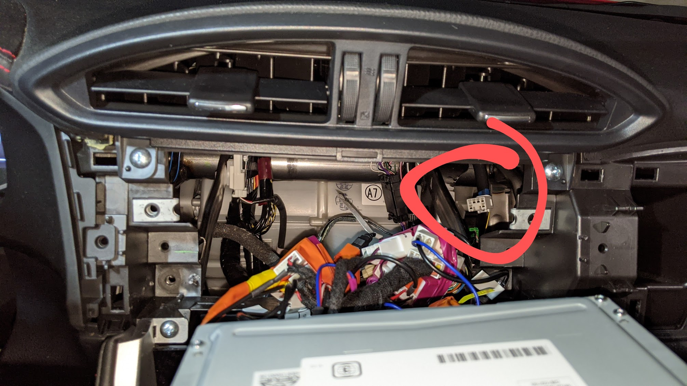

# FT86 cars (Subaru BRZ, Toyota 86, Scion FR-S)

Here is information on some of the PIDs that you're most likely to use with
RaceChrono and equations to get the right scale, etc.

## PID 0xD0

Update frequency: 50 times per second.

Channel name | Equation
------------ | --------
Steering angle | bytesToIntLe(raw, 0, 2) * 0.1
Z rate of rotation | bytesToIntLe(raw, 2, 2) * -0.318309886
??? | bytes 4, 5
Lateral acceleration | bytesToIntLe(raw, 6, 1) * 0.2
Longitudinal acceleration | bytesToIntLe(raw, 7, 1) * -0.1
Combined acceleration | sqrt(pow2(bytesToIntLe(raw, 6, 1) * 0.2) + pow2(bytesToIntLe(raw, 7, 1) * 0.1))

## PID 0xD1

Update frequency: 50 times per second.

Channel name | Equation | Notes
------------ | -------- | -----
Speed | bytesToIntLe(raw, 0, 2) * 0.01569358787 | May want to check the multiplier against an external GPS device
Brake position | min(C / 0.7, 100) | The third byte is the pressure in the brake system, in Bars. The 0.7 divider seems to be a good value to get 100% at pressure slightly higher than those you're likely to use on the track for cars with no aero. You can use 0.8 or 0.9 if you see 100% too often.

# PID 0xD4

Update frequency: 50 times per second.

Channel name | Equation | Notes
------------ | -------- | -----
Wheel speed FL | bytesToIntLe(raw, 0, 2) * 0.01569358787 | Use same multiplier as for speed in 0xD1
Wheel speed FR | bytesToIntLe(raw, 2, 2) * 0.01569358787 | Use same multiplier as for speed in 0xD1
Wheel speed RL | bytesToIntLe(raw, 4, 2) * 0.01569358787 | Use same multiplier as for speed in 0xD1
Wheel speed RR | bytesToIntLe(raw, 6, 2) * 0.01569358787 | Use same multiplier as for speed in 0xD1

# PID 0x140

Update frequency: 100 times per second.

Channel name | Equation | Notes
------------ | -------- | -----
Accelerator position | A / 2.55
Clutch position | (B & 0x80) / 1.28 | On/off only
Engine RPM | C + (D & 63) * 256
??? | byte 4
Throttle position | F / 2.55 | Not tested
??? | bytes 6, 7

# PID 0x141

Update frequency: 100 times per second.

Channel name | Equation | Notes
------------ | -------- | -----
Gear | G & 0xF | Not tested much. The value seems to jump so much that the usefulness is questionable.

Given how frequently 0x141 messages are sent, I presume there's a lot more
interesting info there.

# PID 0x360

Update frequency: 20 times per second.

Channel name | Equation
------------ | --------
Engine oil temperature | C - 40
Coolant temperature | D - 40

# Connections

Besides the CAN pins in the OBD-II port, there is a CAN bus male port hidden
behind the car multimedia head unit:

It's very close to the glovebox, which makes it great for putting your CAN
reader in the glovebox. Such a placement makes sure it's out of the way and you
won't accidentally hit it with your leg while on the track, and also allows
quick access for troubleshooting and experimenting. There's also a second 12V
port inside the glovebox, which makes it easy to use a 12V-to-USB adapter
instead of adding a 12V-to-5V converter to your hardware design.

You can use the two middle pins of a
[Toyota radio harness](https://www.amazon.com/gp/product/B0002BEQJ8)
to connect to the CAN bus in a reliable way.
It's recommended to use a ~60–90 cm (2–3') twisted pair cable between that port
and your CAN reader. I would strongly discourage you from using the screw
terminals on the MCP2515 board, as if the cable comes loose it can cause a short
circuit in the CAN bus (ask me how I know), which will throw a MIL at best, and
who knows what at worst if it happens on the track. Instead, I attached a female
JST SM connector to the cable.
