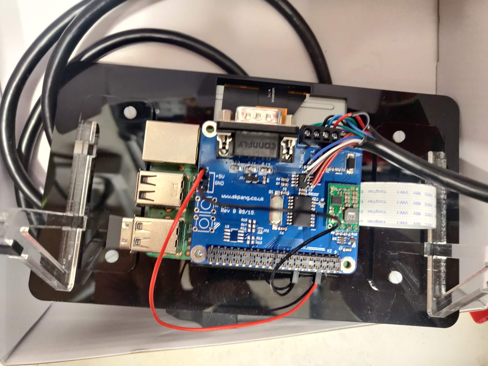
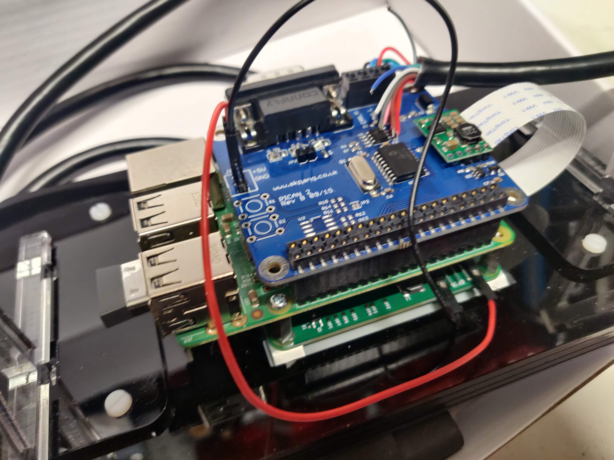
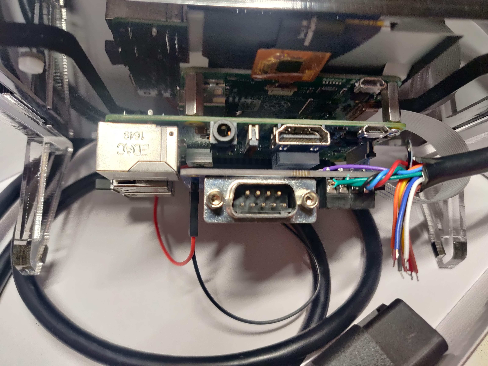
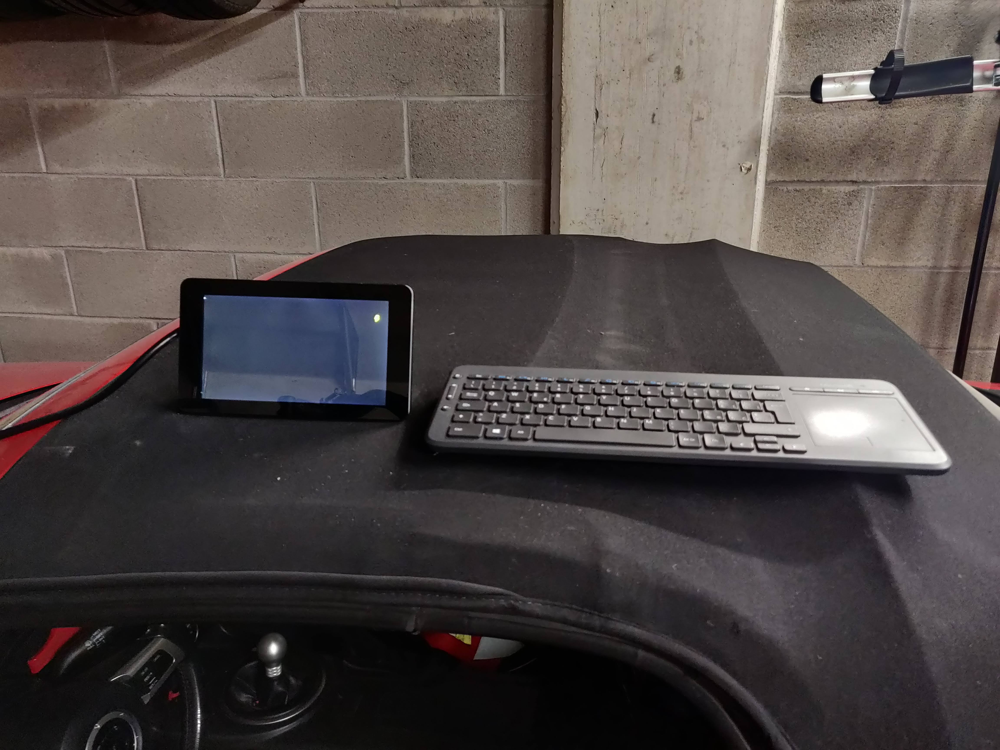
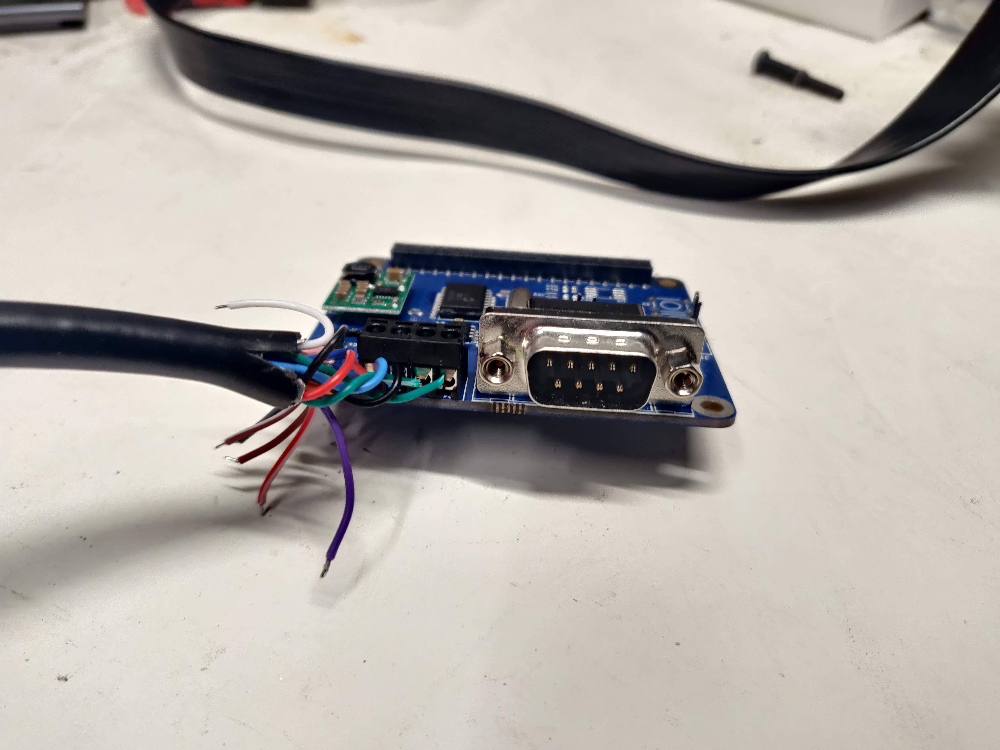
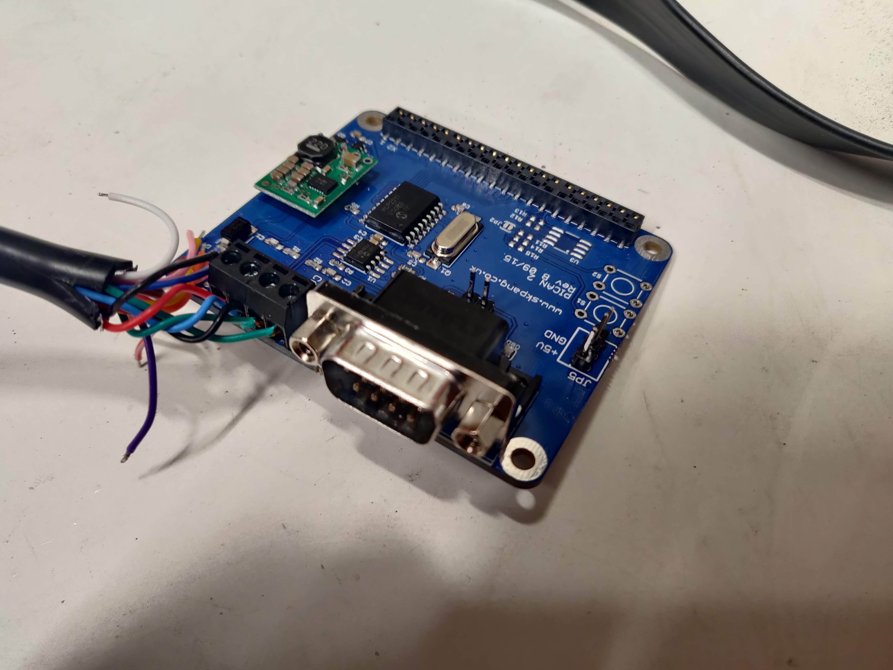
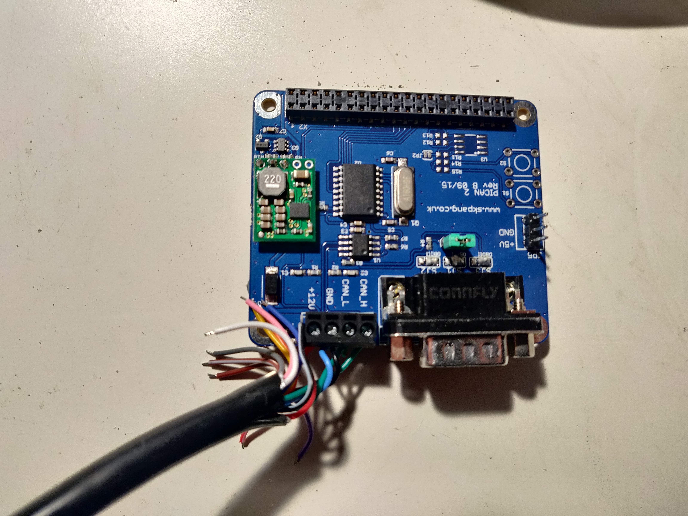
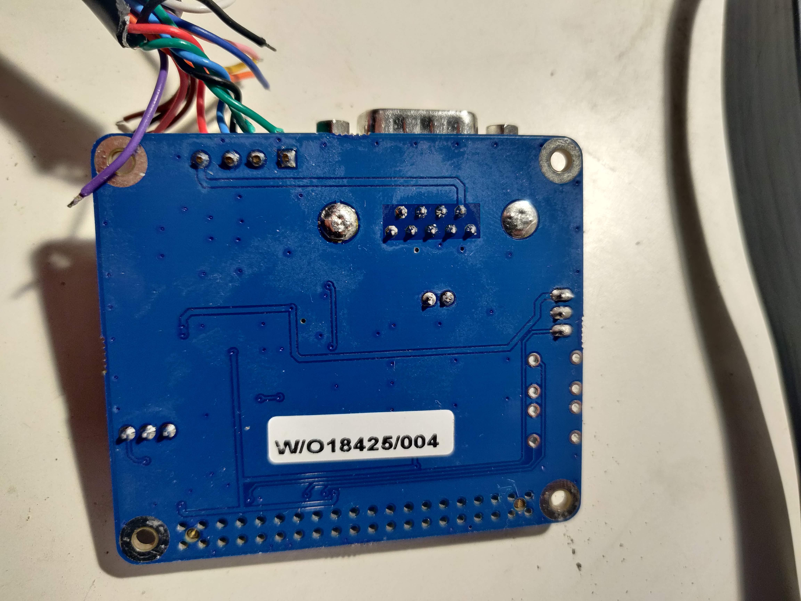

# HOW TO REVERSE ENGINEER YOR CAR CAN-BUS

## REQUIRED KNOWLEDGE

### Something about CAN-Bus
First thing you need to know is what it actually is the CAN-bus and how it does work. I suggest you to read [this article form Madox](http://www.madox.net/blog/2008/11/17/reverse-engineering-the-mazda-can-bus-part-1/)
Practically, you need to know that there are 2 CAN-bus main set of signals, the HS CAN-Bus and the MS CAN-Bus, and for each of these you need to know the baud rate, meaning number of data transmitted per second. In Mazda's case the baud rate for HS is 500000, MS is 125000. HS is usually where the most important data are communicated.
You also need to know that information on CAN-Bus is available in form of "messages" with an ID and a number of bytes (up to 8) containing the actual data.

Bytes are 8 bits long and what you get is usually the hexadecimal value of each one of the 8 bytes. The usable value is then obtained combining one or more bytes and passing through a transfer function. Which byte, how many bytes and the transfer equation are all unknown. **This means you need to know a little bit about binary numbers, including two's complement and endianness.**

Also you need to know where to access the CAN-Bus. Most obvious point is the OBD socket. I suggest to use this point of access for the reverse engineering, since it is easily accessible and the position is well documented over the internet.

### Something about iron soldering
In order to follow this "how to" you may need to use to perform few iron soldering. It is not a big deal, YouTube can help a lot. Just a hint: if you are not great at iron soldering you may want to use wire containing lead, i.e. 60% tin, 40% lead. This kind of wire is not available everywhere, since it is been banned due to environmental concerns. Without lead you need to go up with temperature and the process is not as smooth as with lead, results may be not pretty and in general the experience can be frustrating.

### Something about Raspberry Pi and PiCan
In order to read the CAN-Bus of your car you need a device that can acquire current signals, process and interpret to bytes and then feed to a PC for human reading, logging etc.
There are many ways of doing this, basically you need a MCP2551 based board for the acquiring-processing part and a way to connect this board to a PC.

I've chosen to use Rasperry Pi and a PiCan2 hat due to:
-   Cost of the hardware (I already had a Pi 3B)
-   Ease of assembly
-   Availability of CAN tools for Linux
-   Community support

In any case, whatever will be your choice of hardware, you will need to know your way around a terminal screen, how to install and use command line tools, how to edit configurations file etc.

## HARDWARE
* Raspberry Pi 2 or 3 (I've used 3)
* PiCan 2. [I suggest to use the SMPS version](http://skpang.co.uk/catalog/pican2-canbus-board-for-raspberry-pi-23-with-smps-p-1476.html), so you can draw power directly from OBD socket. In this case you may need to run the Pi as headless system or to provide current to the monitor if you plan to use an external monitor.
* Optionally: an OBD connector with exposed color coded cables and known PIN to cable association. Avoid OBD to DB9 connectors cable, unless your sure the pins are all connected in the right way, also if you use the screw connector you don't have to solder the bridges on the board.
* Optionally: a monitor, I had an official Raspberry 7" touch screen, I was able to run everything with only 12v from OBD socket, even if with a "low voltage" warning

Follow [the official instruction](http://skpang.co.uk/catalog/images/raspberrypi/pi_2/PICAN2SMPSUG13.pdf) for PiCan2 preparation. If you want to power devices other than the Pi from the PiCan2 SMPS you may want to solder a 3 pin header connectors to the 5v - GND. The PiCan2 SMPS will power the Pi via the GPIO connections. You may need to solder 2 pins to use the jumper for the 120 Ω terminator. In my tests the terminator is not needed when you connect to the OBD port.

You then need to connect pins from OBD socket to the PiCan2 screw connector. You may do this via single wires or via OBD connector with exposed cables, just follow this pinout diagram:

this showed here is the front view of the female connector, that is a perfect
match for the back of a male connector.
* Pin 4 and 5 (grey) are chassis ground and signal ground.
* Pin 6 (green, top) is CAN High
* Pin 14 (green, bottom) is CAN Low
* Pin 16 (red) is 12V power from battery

This is the connection scheme

| OBD Pin | PiCan2 Screw Connector label |
| ------ | --------- |
| 4 and 5 | GND |
| 6 | CAN_H |
| 14 | CAN_L |
| 16 | +12V |

Just remember that there is always power at pin 16 on OBD, even if the car is shut down with no key in. 

Here are some pictures of the complete assembly

## SOFTWARE

Follow [the official instruction](http://skpang.co.uk/catalog/images/raspberrypi/pi_2/PICAN2SMPSUG13.pdf) to update Raspbian to latest version, install the `can-utils` and configure the system in order to use the PiCan2 hat.

`can-utils` is set of command line tools that allows the user to tap in the SocketCAN kernel stack to visualize, log and manipulate can signals. For reverse engineering we are going to use 2 commands:
* `cansniffer`: print on screen messages from selected interface visualizing only the IDs that are changing in a period of time. This is very useful because it allows you to see what is changing when you give an input and then associate the value you want to check with the ID name and byte or bytes carrying the information. See [manpage](https://manpages.debian.org/testing/can-utils/cansniffer.1.en.htm) for usage.
* `cansndump`: this command print on screen all messages from the selected interface. It is impossible to follow the stream printed on screen, but `candump` has a log mode that saves all the message in one text file, for further processing offline. See [`cansndump` manpage](https://manpages.debian.org/testing/can-utils/candump.1.en.html) for detailed explanation.

## PROCEDURE

**WARNING** All tests where the engine is running shall be carried on in an outdoor environment!

**WARNING** Don't drive and look at screens! If you want to run rolling tests, ask someone to drive while you check data.

The procedure is common to all reverse engineering projects: you give one input, check what is changing, register the output, compare output values to real word input, try to find the function that translate the registered output to the real world value.

In order to do this you need to start with as less input as possible, and then build up complexity. This means you really need to start looking at data when car is ignition off, then go to ignition on, vary 1 input at time, and only then start the engine.

1. The first things to do is connect your system to the OBD port, key in, ignition off
2. Once the Raspberry Pi is booted, start a terminal window
3. Bring up the CAN interface. You can do this with the command `sudo /sbin/ip link set can0 up type can bitrate 500000` where 500000 is the baud rate of the CAN channel you whant to investigate (in this case is the HS CAN-Bus)
4. Start sniffing, using color codes. To do this use the command `cansniffer -c can0`. Take note of the IDs appearing and which bytes are changing (the colored ones). Do not exit the sniffing mode.
5. Move the key to ignition on. **Do not start the engine**. Take note of the new IDs appearing and which bytes are changing (the colored ones). Do not exit the sniffing mode.
6. Start giving one input. I.e. start moving the steering wheel to right. Do it slowly, take note of the ID and which bytes are changing. You don't need to write the values, you only need to write the position (i.e. byte 0, byte 1 AND byte 2, etc). Once you reached the stop to the right, go back to center and then move to left. Take note, don't quit the sniffing mode.
7. Repeat point above for each input you want to  know. Always only one at a time, from neutral position to the maximum values. You can do it for accelerator, clutch, brakes etc. Remember that the engine is still off so you may receive some signals related to switch and potentiometer but no signals for pressures.
8. Start the engine, transmission in neutral, car parked. New IDs will appear and/or new bytes will be highlighted. Take note. Leave the engine running at idle for a while, you'll see little changes at RPM ID, take note, in modern cars with "dynamic idle" this is done automatically  try to change again 1 input at time and note that tis time the same input may results in two different output. I.e. if you move the accelerator pedal you will see the ID and bytes for accelerator pedal position but also the ID and bytes for RPM change and for throttle valve position, ignition advance, calculated load etc... For now just take note of the position of the bytes changing.
10. Repeat step above until you are satisfied. Once done, turn off the engine and stop the sniffing session, use `ctrl+c` in the terminal window

Click to see the video:

As you can see the output is represented in form

| time | ID | data |
| ----| -----| ----- |
| 0.00x | 85 | 00 00 00 00 00 00 00 00 |
| in this case is delta time | ID is given as hexadecimal value. In RaceChrono "85" will translate to "0x85" | 8 bytes represented by 2 digits hexadecimal values. Bytes are numbered from "0" to "7", if you count this way it will be easier to understand RaceChrono equations |

While `cansniffer` running you can also remove IDs from the list, this is useful in case of signals related to fault codes or flags or sawtooth signals for syncronization.

Now you want to log data, so you can plot values and visualize how they change over time, this will give you the clues for finding the transfer function. To do this, you basically have to run again the same steps done earlier but using the `candump` command. I suggest to prepare a list of things you whant to log and execute them in order. You can create 1 log file for each action, these are timestamped, so then you can associated the file to the action you perform. Here is an example.

You want to log:
- Steering angle
- Accelerator position
- RPM

Then you proceed this way:
1. Connect the system to OBD port
2. Once the Raspberry Pi is booted, start a terminal window
3. Bring up the CAN interface: `sudo /sbin/ip link set can0 up type can bitrate 500000`
4. Move key to ignition on, do not start the engine.
5. Start the first log: `candump -ta -L can0`. Do nothing at all.
6. Wait 20 second then stop the log with `ctrl+c`
7. Start again the log `candump -ta -L can0`, then start to moove very slowly the steering wheel. Go to right, once you reach 90° stay there for a couple of seconds. Then again go slowly to 180° and stay there. Then 270° etc. Proceed with steady ramps and plateau until you reach the end. Then go back to center, you can do it quickly, and start moving to left, again steady ramps and staying in position at known angles. This will help later, when you plot values you can recognize the pattern.
8. Once finished stop the log with `ctrl+c`
9. Start again the log `candump -ta -L can0`, then start pressing the accelerator. Go up to 100% and stay there, then release, go up again to 100% etc. Again you need to create a pattern, so you can recognize the pattern when you plot.
10. Once finished stop the log with `ctrl+c`
11. Start the engine now, transmission in neutral. 
12. Start again the log `candump -ta -L can0`, wait a bit at idle then again press the acclerator, with a known pattern. This time the engine is running so you are logging a lot of stuff. Engine speed and accelerator / throttle position are only partially related, and this is good. You can relate the accelerator patterns to throttle patterns, but RPM will have behave differently an then you can spot it. This time try to maintain some constant RPM, you'll see that since you are in neutral with 0 load you will have to release the accelerator to maintain the RPM once you reach a certain value. 
13. Stop the log with `ctrl+c`.
14. Turn off the car.

You have now 4 log files, time stamped:
- One doing nothing. This may be used as reference.
- One in which only the steering input is changing
- One in which only the accelerator input is changing
- One in which the engine is running and the accelerator input is changing

The files are simple text, every line has this format:
`(1612101751.330652) can0 4B0#2710271027102710`
- `(1612101751.330652)` is absolute time. It may be wrong, because Rarspberry Pi does not have and internal clock. You can log the delta using `-td` instead of `-ta`.
- `can0` is the name of the interface.
- `4B0` is the ID in hexadecimal value.
- `#` separates the ID field from the data field
- `2710271027102710` is the data field, 8 bytes long, each byte is represented by 2 digits hexadecimal: `27` `10` `27` `10` `27` `10` `27` `10`

you can use a wizard to inport in Excel or similar software and split the data in columns using separators (space and `#`) and fixed length for the data field. Just be sure to apply to all data except time the TEXT format. `04` in hexadecimal is not the same as `4` in decimal.

Excel has a function, `HEX2DEC` that converts hexadecimal to unsigned decimal values. You can start plotting de decimal values of each byte or bytes for each ID over time, following the association you gathered during the sniffing phase.

Sometime (i.e. steering angle in my case) you may need to plot the signed value, where the sign is obtained with the "two's complement" notation. In Excel this function is not implemented for 8 bit bytes, so you can use this dirty trick to obtain the signed decimal from cell `A1`
`=HEX2DEC(A1) - IF(HEX2DEC(A1) > POWER(2, 4*LEN(A1))/2 - 1, POWER(2, 4*LEN(A1)), 0)`
this is solved in RaceChrono using the `BytesToInt` function instead of `BytesToUint` (where the U stands for Unsigned)

If the value your looking for is represented by 2 bytes, in excel you need to concatenate as text the cell values: `HEX2DEC(A1&B1)`.

Now, just play with plots and numbers until you see the matrix :) you will be able to spot the patterns you applied to inputs. The transfer function is usually easy to obtain: the easiest is just the translation to signed/unsigned decimal. In other case you may have to apply a scale, i.e. divide by 2 or 4. Usually percentage are represented by 1 byte only, with values from 0 to 255, so for those you maybe just need to multiply by 100 and divide by 255... Sometime you'll have a constant offset, etc...

Sometimes you'll be able to obtain curves but you can't find the absolute real value because you don't have a comparison. This is the case for brake pressure, where you need a pressure indicator somewhere on the brake line to associate the bytes to the real world value. In these cases I suggest you find the maximum digital value and then use the data as percentage, with the correct scaling.

You can proceed with static tests for many inputs, but for speed and acceleration you'll need to run the logs while the car is moving. It may be useful for these tests to log speed and accelartions from a GPS external device.
